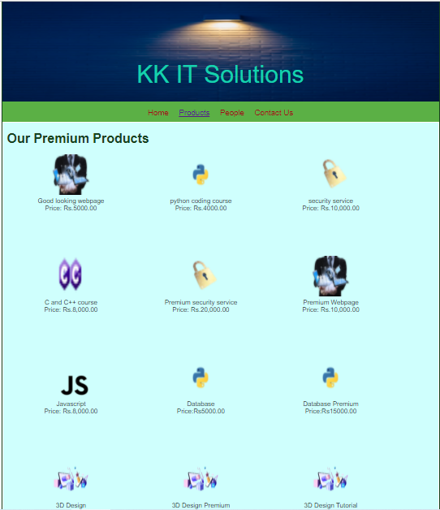

# Web Design for a Software Product Company

## AIM:

To design a static website for a software product company company.

## DESIGN STEPS:

### Step 1:

Requirement collection.

### Step 2:

Creating the layout using HTML and CSS.

### Step 3:

Updating the sample content.

### Step 4:

Choose the appropriate style and color scheme.

### Step 5:

Validate the layout in various browsers.

### Step 6:

Validate the HTML code.

### Step 6:

Publish the website in the given URL.

## PROGRAM :

### Home Page:
```
<!DOCTYPE html>
<html lang="en">
  <head>
    <title>KK IT Solutions</title>
    <link rel="stylesheet" href="./css/layout.css" />
    <link rel="icon" href="./img/icon.png" type="image/x-icon" />
  </head>

  <body>
    <div class="container">
      <div class="banner">KK IT Solutions</div>
      <div class="menu">
        <div class="menuitemselected"><a href="/static/home.html">Home</a></div>
        <div class="menuitem"><a href="/static/products.html">Products</a></div>
        <div class="menuitem"><a href="/static/people.html">People</a></div>
        <div class="menuitem"><a href="/static/contact_us.html">Contact Us</a></div>
      </div>
      <div class="content">
        <div class="homecontent">
          <h1>About Us</h1>
          
          <div class="contenttext">
            We are providing serive as well as teaching the IT sector works.
            <br></br>
            Our main goal is to educate the youngsters about technology.
            This is friendly company created for the improve talent and to reduce unemployment.
              <br></br>
            

            Our products and service are
            <ul>
              <li>Simple to learn, easier to use</li>
              <li>Insightful , actionable & customizable reports</li>
              <li>Anywhere, anytime and secure access</li>
              <li>All products are in best rate</li>
            </ul>
            Even we are recruiting talented as well as exprienced members.
            if you are eligible please contact us through the contact us page
          </div>
        </div>
      </div>
      <div class="footer">
        Copyright &#169; 2021 KK IT Solutions, Developed by Karthikeyan.K.
      </div>
    </div>
  </body>
</html>
```
### products Page:

<!DOCTYPE html>
<html lang="en">
  <head>
    <title>KK IT Solutions</title>
    <link rel="stylesheet" href="./css/layout.css" />
    <link rel="icon" href="./img/icon.png" type="image/x-icon" />
  </head>

  <body>
    <div class="container">
      <div class="banner">KK IT Solutions</div>
      <div class="menu">
        <div class="menuitem"><a href="/static/home.html">Home</a></div>
        <div class="menuitemselected"><a href="/static/products.html">Products</a></div>
        <div class="menuitem"><a href="/static/people.html">People</a></div>
        <div class="menuitem"><a href="/static/contact_us.html">Contact Us</a></div>
      </div>
      <div class="content">
        <div class="productcontent">    
          <h1>Our Premium Products</h1>
          <div class="productitems">
              <div class="productitem"> 
                  <div class="itemimage">
                  
                  </div>
                  <div class="itemname">Good looking webpage</div>
                  <div class="itemprice">Price: Rs.5000.00 </div>
              </div>
              <div class="productitem"> 
                  <div class="itemimage">
                  
                  </div>
                  <div class="itemname">python coding course</div>
                  <div class="itemprice">Price: Rs.4000.00</div>
              </div>
              <div class="productitem"> 
                <div class="itemimage">
                
                </div>
                <div class="itemname">security service</div>
                <div class="itemprice">Price: Rs.10,000.00 </div>
              </div>
              <div class="productitem"> 
                <div class="itemimage">
                
                </div>
                <div class="itemname">C and C++ course</div>
                <div class="itemprice">Price: Rs.8,000.00 </div>
              </div>
              <div class="productitem"> 
                <div class="itemimage">
                
                </div>
                <div class="itemname">Premium security service</div>
                <div class="itemprice">Price: Rs.20,000.00 </div>
              </div>
              <div class="productitem"> 
                <div class="itemimage">
                
                </div>
                <div class="itemname">Premium Webpage</div>
                <div class="itemprice">Price: Rs.10,000.00 </div>
              </div> 
              <div class="productitem"> 
                <div class="itemimage">
                
                </div>
                <div class="itemname">Javascript</div>
                <div class="itemprice">Price: Rs.8,000.00 </div>       
              </div> 
              <div class="productitem"> 
                <div class="itemimage">
                
                </div>
                <div class="itemname">Database </div>
                <div class="itemprice">Price:Rs5000.00</div>
            </div>
            <div class="productitem"> 
              <div class="itemimage">
              
              </div>
              <div class="itemname">Database Premium</div>
              <div class="itemprice">Price:Rs15000.00</div>
            </div>
            <div class="productitem"> 
              <div class="itemimage">
              
              </div>
              <div class="itemname">3D Design</div>
              <div class="itemprice">Price:Rs5000.00</div>
            </div>
            <div class="productitem"> 
              <div class="itemimage">
              
              </div>
              <div class="itemname">3D Design Premium</div>
              <div class="itemprice">Price:Rs10000.00</div>
            </div>
            <div class="productitem"> 
              <div class="itemimage">
              
              </div>
              <div class="itemname">3D Design Tutorial</div>
              <div class="itemprice">Price:Rs15000.00</div>
            </div>

      <div class="footer">
        Copyright &#169; 2021 KK IT Solutions, Developed by Karthikeyan.K.
      </div>
    </div>
  </body>
</html>
      
 ### people Page:     

 <!DOCTYPE html>
<html lang="en">
  <head>
    <title>KK IT Solutions</title>
    <link rel="stylesheet" href="./css/layout.css" />
    <link rel="icon" href="./img/icon.png" type="image/x-icon" />
  </head>

  <body>
    <div class="container">
      <div class="banner">KK IT Solutions</div>
      <div class="menu">
        <div class="menuitem"><a href="/static/home.html">Home</a></div>
        <div class="menuitem"><a href="/static/products.html">Products</a></div>
        <div class="menuitemselected"><a href="/static/people.html">People</a></div>
        <div class="menuitem"><a href="/static/contact_us.html">Contact Us</a></div>
      </div>
      <div class="content">
        <div class="productcontent">    
          <h1>Our Proud Board Of Members</h1>
          <div class="productitems">
              <div class="productitem"> 
                  <div class="itemimage">
                  
                  </div>
                  <div class="itemname">Bill Gates</div>
                  <div class="itemprice">CEO</div>
              </div>
              <div class="productitem"> 
                  <div class="itemimage">
                  
                  </div>
                  <div class="itemname">Larry Ellison</div>
                  <div class="itemprice">Chief Consultant</div>
              </div>
              <div class="productitem"> 
                <div class="itemimage">
                
                </div>
                <div class="itemname">Jeff Bezos</div>
                <div class="itemprice">Managing Director </div>
              </div>
              <div class="productitem"> 
                <div class="itemimage">
                
                </div>
                <div class="itemname">Elon Musk</div>
                <div class="itemprice">Manager</div>
              </div>
              <div class="productitem"> 
                <div class="itemimage">
                
                </div>
                <div class="itemname">Sundar Pichai</div>
                <div class="itemprice">Chief Software Engineer</div>
              </div>
              <div class="productitem"> 
                <div class="itemimage">
                
                </div>
                <div class="itemname">Steve Jobs</div>
                <div class="itemprice">HR</div>
              </div>
          </div>
          </div>        
      </div>
      <div class="footer">
        Copyright &#169; 2021 KK IT Solutions, Developed by Karthikeyan.K.
      </div>
    </div>
  </body>
</html>
      
### contact_us Page:
      
!DOCTYPE html>
<html lang="en">
  <head>
    <title>KK IT Solutions</title>
    <link rel="stylesheet" href="./css/layout.css" />
    <link rel="icon" href="./img/icon.png" type="image/x-icon" />
  </head>

  <body>
    <div class="container">
      <div class="banner">KK IT Solutions</div>
      <div class="menu">
        <div class="menuitem"><a href="/static/home.html">Home</a></div>
        <div class="menuitem"><a href="/static/products.html">Products</a></div>
        <div class="menuitem"><a href="/static/people.html">People</a></div>
        <div class="menuitemselected"><a href="/static/contact_us.html">Contact Us</a></div>
      </div>
      <div class="content">
        <div class="homecontent">
          <h1>About Us</h1>
          
          <div class="contenttext">
            Mail Id:KK_IT_Solutions2021@gmail.com
            <br></br>
            Mobile:8658738274
            <br></br>
            Address:Anna Nagar,Chennai
            <br></br> 
            for applying job submit your resume to the above mail Id
          </div>
        </div>
      </div>
      <div class="footer">
        Copyright &#169; 2021 KK IT Solutions, Developed by Karthikeyan.K.
      </div>
    </div>
  </body>
</html>   

### css layout page:

* {
  box-sizing: border-box;
  font-family: Arial, Helvetica, sans-serif;
}
body {
  background-color: whitesmoke;
  color: #17421d;
}
.container {
  width: 1080px;
  margin-left: auto;
  margin-right: auto;
  border-width: 1px 1px 1px 1px;
  border-style: solid;
  box-shadow: 15px 15px 8px gray;
}

.banner {
  display: block;
  width: 100%;
  height: 250px;
  text-align: center;
  font-size: 60px;
  background-image: url("/static/img/background.jpg");
  background-size: 100% 100%;
  margin: 0px 0px 0px 0px;
  padding-top: 150px;
  color: #16d1ae;
}

.menu {
  display: block;
  width: 100%;
  height: 50px;
  font-size: larger;
  background-color: #5bb045;
  text-align: center;
  padding-top: 15px;
  margin: 0px 0px 0px 0px;
  border-width: 1px;
}

.menuitem {
  display: inline-block;
  margin-left: 10px;
  margin-right: 10px;
}
.menuitemselected {
  display: inline-block;
  margin-left: 10px;
  margin-right: 10px;
  color: #16d1ae;
}

.menuitem a {
  text-decoration: none;
  color: #9c1018;
}

.content {
  display: block;
  width: 100%;
  background-color: #cffffd;
  min-height: 500px;
  margin: 0px 0px 0px 0px;
  border-width: 1px;
  border-color: white;
  border-style: solid;
}
.homecontent {
  min-height: 500px;
  margin: 10px 10px 10px 10px;
}
.homecontent h1 {
  text-align: left;
}
.homecontent img {
  float: right;
  width: 400px;
  height: 300px;
  margin-left: 10px;
}

.contenttext {
  text-align: justify;
}

.productcontent {
  min-height: 500px;
  margin: 10px 10px 10px 10px;
}

.productcontent h1 {
  text-align: left;
}

.productitems {
  display: block;
}

.productitem {
  display: inline-block;
  width: 30%;
  height: 250px;
  text-align: center;
}

.productitem img {
  width: 100px;
  height: 100px;
  display: block;
}
.productitem .itemimage {
  display: block;
  margin-left: auto;
  margin-right: auto;
  width: 100px;
  margin-bottom: 5px;
}

.productitem .itemname {
  display: block;
}
.productitem .itemprice {
  display: block;
}

.footer {
  display: block;
  width: 100%;
  height: 40px;
  background-color: #5bb045;
  text-align: center;
  padding-top: 10px;
  margin: 0px 0px 0px 0px;
  color: #9c1018;
}

## OUTPUT:

### Home Page:


### products page:



### people page:


### contact_us page:


## Result:

Thus a website is designed for the software product company and the HTML,CSS code are validated.
